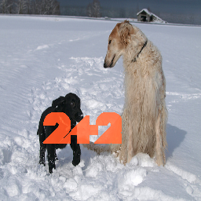
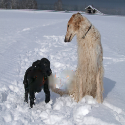
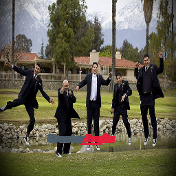
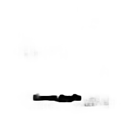
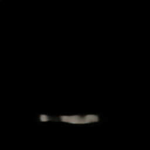
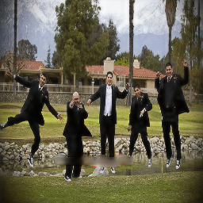

# LogoRemover
Deep neural network to identify and fill watermarks and logos transposed on images

I do not endorse stealing content from creators, and this model will likely not be good enough anyway to go unoticed. I simply created this project as it would help me practice multiple aspects of image processing, masking, and recognition without the gaurd rails of any tutorials.

# Data

Random company logos were collected from https://logos.fandom.com/wiki/Logopedia:Recent_logos/Archive

Using selenium I scraped these images and saved them locally

The actual image dataset came from https://www.kaggle.com/adityajn105/flickr8k (ignoring the captions), but any dataset with real world images should work

During training the logos are transposed onto a random image in a random location with a randon transparency. A mask of the location of the logo is generated as well as the missing information picture

# Model

The model is composed of 3 main part. The first output is the mask of the missing image location. This is multiplied with the image and therefore wherever the mask contained 0s (the predicted transposed watermark), the image was cleared. Then another part of the model was run which predicts the missing pixel values in the masked region. This is added to the image which was cleared of the logo. Finally a third part smoothens the boundries of the image and sharpens the features.

# Outputs

Before                     |Predicted
:-------------------------:|:-------------------------:
 | 

## Earlier model with steps
Before
 |  |  | 

